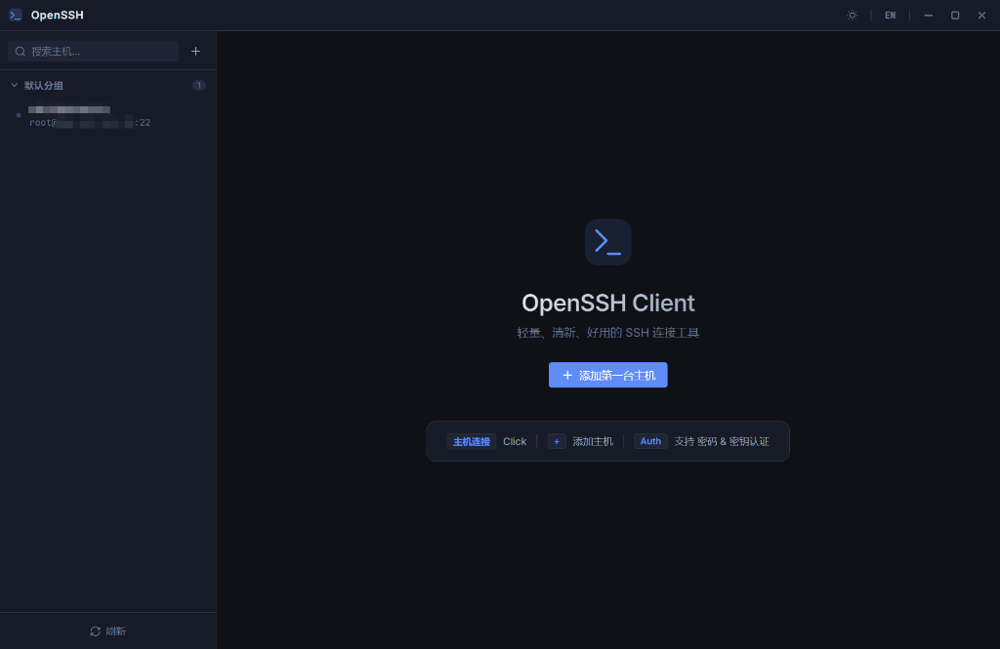
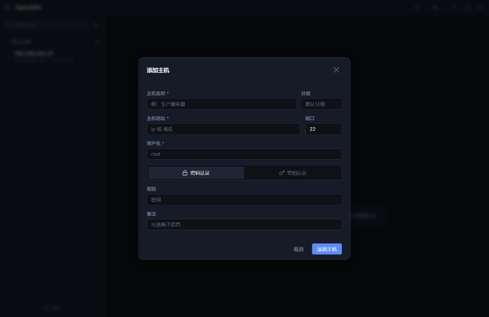
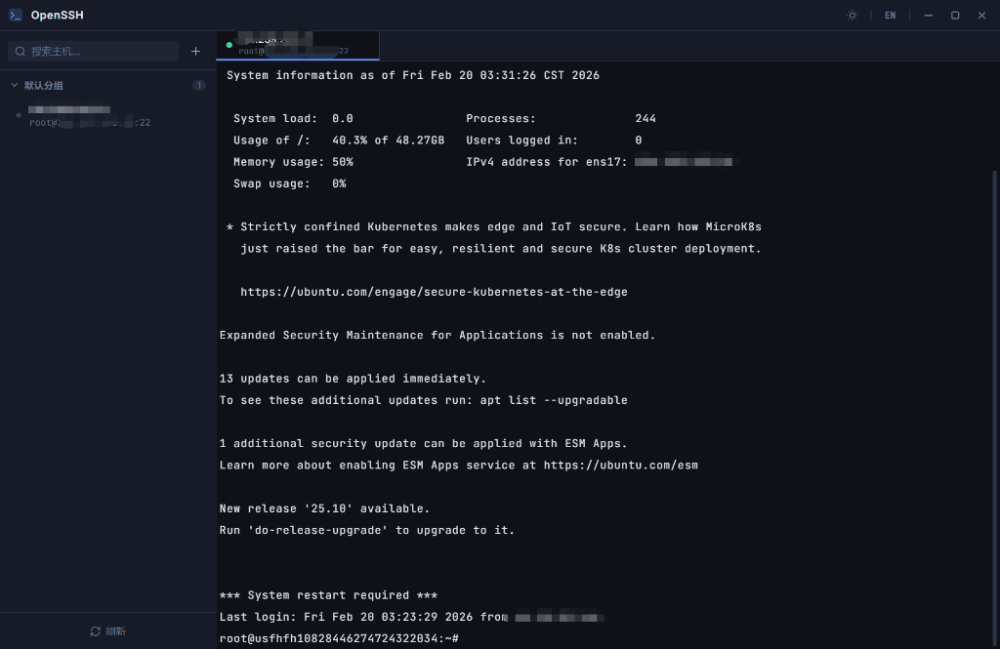

<div align="center">


# OpenSSH Client

**A lightweight, clean & modern SSH client built with Electron + Vue 3**

**基于 Electron + Vue 3 构建的轻量、简洁、现代 SSH 客户端**

[](LICENSE)
[](https://www.electronjs.org/)
[](https://vuejs.org/)

[English](#english) · [中文](#中文)

</div>

---

## English

### ✨ Features

#### 🖥️ Host Management
- Add, edit, and delete SSH hosts with full form support
- Group hosts into custom categories (Default Group supported)
- Search hosts by name or address in real-time

#### 🔐 Authentication
- **Password Authentication** — standard username/password login
- **Private Key Authentication** — PEM format private key with optional passphrase

#### 📑 Multi-Tab Session
- Open multiple SSH sessions simultaneously in tabs
- **Duplicate Session** — right-click a tab to clone a connection instantly
- **Rename Tab** — double-click tab title to rename
- **Close Others** — right-click to close all other tabs

#### 💻 Modern Terminal
- Powered by `xterm.js` with full True Color support
- **Day / Night Mode** — switch between Light and Dark themes with one click
- Right-click context menu: Copy, Paste, Clear
- Keyboard shortcuts: `Ctrl+Shift+C` to Copy · `Ctrl+Shift+V` to Paste
- Auto-fit terminal on window resize

#### 🌐 Internationalization (i18n)
- Switch between **English** and **Chinese (简体中文)** at runtime
- Language preference is saved and restored on next launch

#### 🎨 Refined UI
- Custom frameless title bar with window controls
- Clean sidebar with host list, search, and refresh
- Smooth animations and transitions throughout

---

### 🛠 Tech Stack

| Layer | Technology |
|-------|-----------|
| Core | Electron 29, Node.js |
| Frontend | Vue 3, Vite |
| Terminal | xterm.js, addon-fit, addon-web-links |
| SSH | ssh2 |
| Storage | electron-store |
| i18n | vue-i18n |

---

### 🚀 Getting Started

#### Prerequisites
- Node.js **v18+**
- npm

#### Install

```bash
git clone https://github.com/your-username/openssh-client.git
cd openssh-client
npm install
```

#### Development

```bash
npm run dev
```

#### Build

```bash
# Build for Windows (.exe installer)
npm run build:win

# Build for macOS (.dmg) — run on macOS for best results
npm run build:mac

# Build for current platform
npm run package
```

> **Note for macOS builds on Windows:** Cross-platform macOS builds are limited — no code signing is possible, and the resulting `.app` may be blocked by macOS Gatekeeper. It is strongly recommended to build on a real Mac.

The output files will be placed in the `release/` directory.

---

### 📂 Project Structure

```
openssh-client/
├── src/
│   ├── main/               # Electron main process (SSH, IPC, Store)
│   ├── preload/            # Preload scripts (IPC bridge)
│   └── renderer/           # Vue 3 frontend
│       ├── src/
│       │   ├── components/ # UI components
│       │   ├── locales/    # i18n language files (en.js, zh.js)
│       │   └── styles/     # Global CSS & design tokens
│       └── index.html
├── resources/              # Static assets (app icon)
├── electron.vite.config.js
└── package.json
```

---

### 📸 Screenshots

| Welcome Screen | Add Host | Terminal Session |
|:-:|:-:|:-:|
|  |  |  |

---

### 📄 License

This project is licensed under the [MIT License](LICENSE).

---
---

## 中文

### ✨ 功能特性

#### 🖥️ 主机管理
- 完整的增删改查表单，轻松管理 SSH 主机
- 支持自定义分组（默认分组自动归类）
- 实时搜索主机名或地址

#### 🔐 认证方式
- **密码认证** — 标准用户名 + 密码登录
- **私钥认证** — 支持 PEM 格式私钥，可选 passphrase 短语

#### 📑 多标签会话
- 同时开启多个 SSH 标签会话
- **复制会话** — 右键标签一键克隆当前连接
- **重命名标签** — 双击标签名即可重命名
- **关闭其他标签** — 右键菜单快速关闭其余所有标签

#### 💻 现代终端
- 基于 `xterm.js`，完整支持 True Color
- **日夜模式** — 一键切换亮色与暗色主题，终端配色同步切换
- 右键菜单：复制、粘贴、清屏
- 快捷键：`Ctrl+Shift+C` 复制 · `Ctrl+Shift+V` 粘贴
- 窗口缩放时终端自动适配尺寸

#### 🌐 国际化 (i18n)
- 运行时切换 **中文（简体）** 与 **English**
- 语言偏好自动保存，下次启动恢复

#### 🎨 精致 UI
- 自定义无边框标题栏，集成窗口控制按钮
- 简洁侧边栏，包含主机列表、搜索和刷新
- 全局动画过渡效果，体验流畅

---

### 🛠 技术栈

| 层级 | 技术 |
|------|------|
| 核心 | Electron 29, Node.js |
| 前端 | Vue 3, Vite |
| 终端 | xterm.js, addon-fit, addon-web-links |
| SSH | ssh2 |
| 存储 | electron-store |
| 国际化 | vue-i18n |

---

### 🚀 快速开始

#### 前置要求
- Node.js **v18+**
- npm

#### 安装

```bash
git clone https://github.com/your-username/openssh-client.git
cd openssh-client
npm install
```

#### 开发模式运行

```bash
npm run dev
```

#### 打包构建

```bash
# 构建 Windows 安装包 (.exe)
npm run build:win

# 构建 macOS 应用 (.dmg)，建议在 Mac 上执行
npm run build:mac

# 按当前操作系统自动构建
npm run package
```

> **在 Windows 上构建 macOS 包的注意事项：** 跨平台构建 macOS 应用有限制 —— 无法进行代码签名，生成的 `.app` 可能会被 macOS Gatekeeper 拦截。**强烈建议在 Mac 机器上执行 macOS 的构建任务。**

构建产物将输出到项目根目录下的 `release/` 文件夹。

---

### 📂 项目结构

```
openssh-client/
├── src/
│   ├── main/               # Electron 主进程（SSH、IPC、数据存储）
│   ├── preload/            # 预加载脚本（IPC 桥接）
│   └── renderer/           # Vue 3 前端
│       ├── src/
│       │   ├── components/ # UI 组件
│       │   ├── locales/    # 国际化语言文件 (en.js, zh.js)
│       │   └── styles/     # 全局 CSS 和设计变量
│       └── index.html
├── resources/              # 静态资源（应用图标）
├── electron.vite.config.js
└── package.json
```

---

### 📸 应用截图

| 欢迎页 | 添加主机 | 终端会话 |
|:-:|:-:|:-:|
|  |  |  |

---

### 📄 开源协议

本项目基于 [MIT 协议](LICENSE) 开源。
